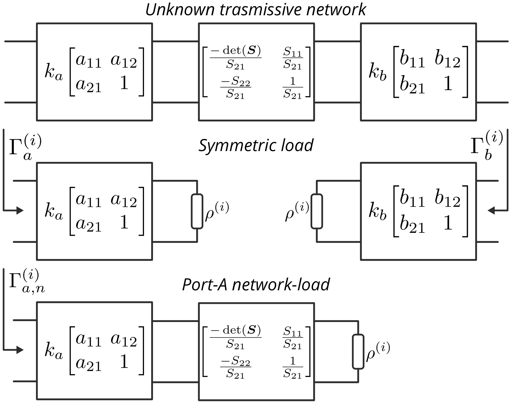

# Symmetric-Reciprocal-Match (SRM) Calibration

A self-calibration procedure for vector network analyzers (VNAs) called Symmetric-Reciprocal-Match (SRM) method that uses partial defined standards.

## TO-DO

- Include a non-linear optimization procedure to automatically estimate parasitic elements of match standards, given only the DC resistance of the match.

## **Basic principle**

SRM calibration involves measuring multiple partially defined standards. The measurements include:

- At least 3 unique one-port measurements, such as short, open, and match.
- A two-port reciprocal device.
- One-port measurement using the two-port device and the one-port standards.
- A match standard at each port to set the reference impedance.

During calibration, all standards are not specified except for the match standard. However, an estimate of the standards should be provided to resolve order/sign ambiguity during the calculations. The picture below provides a diagrammatic description of the standards. See [1] for details on an alternative implementation of the network-load standard using half of the network (also see CPW example below).


_SRM standards. Match is not shown, but could be part of the symmetric one-port standards. There should be at least 3 different one-port standards measured_

## Code requirements

For the script [`srm.py`][srm] You only need [`numpy`](https://github.com/numpy/numpy) and [`scikit-rf`](https://github.com/scikit-rf/scikit-rf) installed in your Python environment. To install these packages, run the following command:

```python
python -m pip install numpy scikit-rf -U
```

Regarding the dependencies for the example files, simply refer to the header of the files.

## Sample code

The [`srm.py`][srm] file should be located in the same folder as your main script, which is loaded through the import command. Switch terms not included in code below, but the script support switch terms (just read the variable definition in [`srm.py`][srm]).

```python
import skrf as rf
import numpy as np

from skrf.media import Coaxial # to create estimated values

from srm import SRM # my code

# import measurements from symmetric one-port standards as two-port networks
open_meas  = rf.Network('open_meas.s2p')
short_meas = rf.Network('short_meas.s2p')
match_meas = rf.Network('match_meas.s2p')

# import measurement of reciprocal network
reciprocal_meas = rf.Network('reciprocal_meas.s2p')

# import measurments of network-load standards from either ports
recip_open_A_meas  = rf.Network('recip_open_A_meas.s2p').s11
recip_short_A_meas = rf.Network('recip_short_A_meas.s2p').s11
recip_match_A_meas = rf.Network('recip_match_A_meas.s2p').s11

# create estimate for symmetric one-port standards and reciprocal network
freq = open_meas.frequency
coax = Coaxial(freq, Dint=1.270e-3, Dout=2.92e-3)

open_est  = coax.open()
short_est = coax.short()
match_est = coax.match()
reciprocal_est = coax.line(16e-3, 'm')

# SRM calibration
cal = SRM(symmetric=[open_meas, short_meas, match_meas], 
          est_symmetric=[open_est, short_est, match_est], # only one is required (at best open or short) 
          reciprocal=reciprocal_meas,
          est_reciprocal=reciprocal_est,
          reciprocal_GammaA=[recip_open_A_meas, recip_short_A_meas, recip_match_A_meas], 
          matchA=match_meas.s11, matchB=match_meas.s22 # ref impedance is now defined to the match standard
          )
cal.run()

dut_meas  = rf.Network('dut_meas.s2p') # import dut measurement
dut_cal = cal.apply_cal(dut_meas)      # apply calibration
```

## Examples

### Coaxial measurements

This example simply uses coaxial standards. However, it is important to be careful with the adapter. The adapter used for the two-port measurement (middle picture below) should be of the same length as the adapter used to create the network load (last picture on the right). Also, don't ask about the resistors holding the cables. Let's just say I had to do what was necessary to fix the cables in place 😅

 |  | 
:-: | :-: | :-:
_Symmetric load_ | _Reciprocal network_ | _Network-load_

Below are the results of measuring verification kits. The cause of the ripple in the offset short is discussed in [1]. As for the SOLR, the SOL cal standards have already been characterized by the manufacturer (also, the calibration kit was brand new).


_Comparison between calibrated verification kit using SRM and SOLR_

### CPW numerical simulation

This example showcases how the SRM method can be used for on-wafer applications. In the example, I provide two scenarios: one using a full-network and the other using a half-network. The latter case is illustrated below.


_Illustration of CPW structures implementing the half-network approach of SRM calibration. The match standard is optional if the symmetric impedance standard is reused as the match standard._

The simulation outcome is not surprising: it yields exact results, as indicated by the error vector graph of the calibrated DUT (step-impedance), which approaches zero and is limited only by numerical precision of the software.


_Error vector comparing full- an half-network approaches of SRM calibration_

## Crediting

If you found yourself using the method presented here in a publication, please consider citing [1]. If you want to reuse the measurement data in your own publication, please cite [2].

## References

[1] Z. Hatab, M. E. Gadringer, and W. Bösch, "Symmetric-Reciprocal-Match Method for Vector Network Analyzer Calibration" 2023, e-print: *to be updated on 7th of September 2023*.

[2] Z. Hatab, "Symmetric-Reciprocal-Match Calibration: Dataset and Code". Graz University of Technology. doi: to be updated on 7th of September 2023*.

## License

Feel free to do whatever you want with the code under limitations of [BSD-3-Clause license](https://github.com/ZiadHatab/srm-calibration/blob/main/LICENSE).

[srm]: https://github.com/ZiadHatab/srm-calibration/blob/main/srm.py
